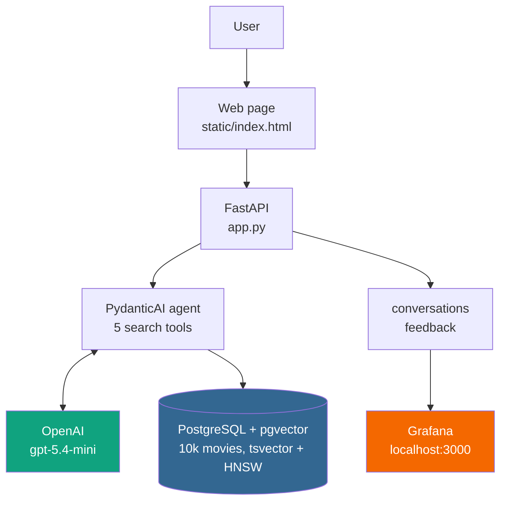

[](https://github.com/davidevdt/CineVec/actions/workflows/ci.yml)
[](https://github.com/davidevdt/CineVec/actions/workflows/cd.yml)


# CineVec
## An AI Agent for Movie Recommendations

A movie recommendation agent over 10,000 TMDB films. Ask in your own words —
*"something like Toy Story, from the same decade"*, *"best rated dramas of the
90s"*, *"a slow dreamlike sci-fi about memory"* — and it decides how to search,
runs the query against Postgres, and answers with real rows from the database.

Built as a project for the [LLM Zoomcamp](https://github.com/DataTalksClub/llm-zoomcamp) course - 2026 Cohort.

## Problem

Streaming catalogues are searchable by title and filterable by genre, which is
useless for the way people actually think about films. You remember a *feeling*,
a half-plot, an era. Keyword search can't answer "a heist film but funny", and
pure semantic search can't answer "best rated, over 1000 votes, French, 90s"
because those are database constraints, not vibes.

CineVec puts both behind an LLM agent that picks the right tool per question:

1. **Structured filters** — year, genre, language, rating, vote count
2. **Full-text search** — Postgres `tsvector`, weighted by field
3. **Vector search** — 384-dim embeddings, pgvector HNSW index
4. **Hybrid** — full-text and vector fused with Reciprocal Rank Fusion
5. **Similar-to** — nearest neighbours of a movie's own embedding

The agent chooses; the database does the work. "Best rated" sorts by a Bayesian
weighted rating, so a film with 8.6 from 255 votes doesn't beat *The Godfather*.

## Quickstart

```bash
cp .env.example .env      # add your OPENAI_API_KEY and Postgres credentials
make up                   # starts postgres, the app and grafana; follows the log
```

Then open **http://localhost:8000** — that serves the web page, where you type a
question, get the answer rendered, and rate it 👍/👎. No separate frontend to
start: FastAPI serves both the page and the API.

| | |
|---|---|
| **Web page** — ask questions, read answers, leave feedback | http://localhost:8000 |
| API docs (Swagger) | http://localhost:8000/docs |
| Grafana dashboard | http://localhost:3000 (admin / admin) |

The **first** run downloads the dataset and embeds all 10,000 plots, which takes
a few minutes. Later starts reuse both and are ready in under a second.

### The web page

A single self-contained `static/index.html` — no build step, no framework, no
external requests. A text box, four example questions you can click, and the
answer rendered underneath with 👍/👎 buttons that post back to `/feedback`, so
every rating lands in the Grafana dashboard. It follows your system light/dark
theme.

### Prerequisites

- Docker and Docker Compose
- An OpenAI API key
- [uv](https://docs.astral.sh/uv/) — only if you want to run it outside Docker

### Running outside Docker

```bash
uv sync
docker compose up -d db          # just the database
uv run uvicorn app:app --reload
```

`.env` should have `POSTGRES_HOST=localhost` for this; Compose overrides it to
`db` for the containers, so both paths work from one file.

## Usage

The easiest way is the web page at http://localhost:8000. Everything below is the
same thing over HTTP, for scripting or for checking it works.

```bash
curl -X POST localhost:8000/ask -H 'Content-Type: application/json' \
  -d '{"question": "French comedies rated above 7"}'
```

```json
{
  "answer": "Here are 5 French comedies rated above 7:\n\n1. **The Intouchables** (2011) ...",
  "conversation_id": 42
}
```

Send the `conversation_id` back with a thumbs up or down:

```bash
curl -X POST localhost:8000/feedback -H 'Content-Type: application/json' \
  -d '{"conversation_id": 42, "score": 1}'
```

The web page does exactly this when you click 👍/👎 under an answer.

## Architecture



One Postgres instance holds both the movies and the monitoring tables. They sit
on **separate SQLAlchemy metadata registries**, so rebuilding the dataset
(`REBUILD=true`, which drops and re-ingests `movies`) cannot wipe the
conversation history.

## Tools used

| | |
|---|---|
| **FastAPI** + uvicorn | HTTP API and static page |
| **PydanticAI** | agent loop, tool calling, structured output |
| **OpenAI gpt-5.4-mini** | the model behind the agent |
| **PostgreSQL 17 + pgvector** | one store for rows, full-text and vectors |
| **SQLAlchemy** | schema and queries |
| **ONNX Runtime** + `Xenova/all-MiniLM-L6-v2` | embeddings, 384-dim, no PyTorch |
| **Grafana** | monitoring dashboard, provisioned from files |
| **uv** | dependency management |
| **ruff** + **mypy** | lint, format and type checking |
| **Docker Compose** | the whole stack |

No vector database: Postgres with pgvector does full-text *and* vector search in
one query, which is what makes single-statement RRF possible.

## Evaluation

`notebooks/retrieval_tuning.ipynb` measures retrieval quality and tunes the
search parameters. Ground truth: 500 movies × 5 LLM-generated search queries,
none naming its own film — 2,307 questions after dropping title leakage.

Metrics are hit rate and MRR, over the top 5 (what the agent shows).

| config | hit@5 | mrr@5 | hit@10 | mrr@10 |
|---|---|---|---|---|
| before tuning | 0.355 | 0.273 | 0.396 | 0.279 |
| **after tuning** | **0.522** | **0.385** | **0.593** | **0.395** |

**+16.7 points of hit rate**, 95% CI [+13.5, +16.8] from a bootstrap paired over
movies. Tuned values are in `config/config.yaml`.

What actually moved the needle, in order:

1. **`hybrid-text-mode: fallback`** — see below. On its own, +1.7pp.
2. **Weights inverted**: title 1.0 → 0.2, plot 0.4 → 1.0. The plot carries the
   signal; the title is nearly noise when the query doesn't name the film.
3. **`rrf-k` 60 → 5** — trust a text hit strongly when there is one.
4. `n-candidates` and the genres weight are worth under a point between them.

## Monitoring

Every `/ask` writes a row: question, answer, model, input/output tokens, cost,
latency, and **which tools the agent chose** — recorded as e.g.
`{get_movie_details, search_movies:hybrid}`, so the dashboard shows whether the
vector index is earning its keep. Thumbs up/down link back by `conversation_id`.

Grafana comes up already configured — datasource and dashboard are provisioned
from files in `grafana/`, so a fresh `docker compose up` on a new machine has the
dashboard immediately. Ten panels: question volume, cost, latency, token use over
time, feedback split, tool/search-mode usage, and the most recent conversations.

## Difficulties

The interesting failures, since they shaped the code:

**Genres were stored as arrays of single characters.** `"Drama,Crime"` was split
on `|` instead of `,`, then round-tripped through CSV, so a Python string reached
a `text[]` column and psycopg iterated it letter by letter. Every genre filter
silently matched **zero** rows — "French comedies rated above 7" returned nothing
while 85 existed. It also polluted the embeddings, whose input text included
`Genres: [, ', D, r, a, m, a...`. Found only because a demo query returned an
empty result that looked plausible.

**Hybrid search wasn't hybrid.** `websearch_to_tsquery` joins terms with AND, and
a plot is about two sentences, so any sentence-length query matched nothing. The
text arm returned zero rows, RRF fused one list, and the result was pure vector
search — with all five tuning knobs provably inert. Three wildly different
configurations returned byte-identical results. The fix (`text_mode="fallback"`:
AND, falling back to OR only when AND finds nothing) is deliberately conservative,
because the sweep showed **plain OR is far worse than doing nothing** (0.26 vs
0.36 hit@5) — it floods the ranking with weak single-word matches.

**RRF ties made results non-deterministic.** A text-only hit at rank *r* scores
`1/(k+r)`, identical to a vector-only hit at rank *r*. With no tiebreaker,
Postgres returned tied rows in arbitrary order, so the same query could come back
ordered differently between calls. Caught because MRR@10 came out *lower* than
MRR@5, which is mathematically impossible. Every `ORDER BY` now ends in `m.id`.

**Threads and async don't mix here.** Generating the ground truth with
`agent.run_sync` in a `ThreadPoolExecutor` built a fresh event loop and HTTP
client per worker; 50 movies didn't finish in an hour. The same work with an
`asyncio.Semaphore` took 16 seconds for 60.

## Development

```bash
make format      # ruff format + ruff check --fix
make check       # what CI runs: ruff format --check, ruff check, mypy
```

CI runs those on every push and pull request. CD builds the image and pushes it
to GitHub Container Registry on every push to `main`.

## Project structure

```text
app.py                     FastAPI app: /, /ask, /feedback, /health
orchestrator.py            CLI: ingest, then a REPL against the agent
cinevec/
  agent/
    movie_agent.py         the PydanticAI agent and its 5 tools
    search.py              all search modes, including the RRF query
    prompts.py             system prompt
    evaluate.py            hit rate, MRR, parameter sweep
  ingestion/
    data_loader/           download and clean the TMDB csv
    embed/                 ONNX embedder and model download
    db/                    schema, engine, ingestion
  monitoring/
    models.py              conversations + feedback (own DeclarativeBase)
    metrics.py             tokens, cost, tool extraction
    db.py                  reads and writes
static/index.html          the web page, no build step
grafana/                   provisioned datasource and dashboard
notebooks/
  data_download.ipynb      dataset exploration and the weighted rating
  retrieval_tuning.ipynb   ground truth, metrics, parameter sweep
config/config.yaml         search parameters, model and cost rates
```

## Dataset

[10,000 top-rated TMDB movies](https://huggingface.co/datasets/jason1966/ahsanaseer_top-rated-tmdb-movies-10k):
title, year, genres, original language, rating, vote count and plot. Ingestion
adds an IMDb-style Bayesian `weighted_rating`, a weighted `tsvector`, and a
384-dim embedding of title + genres + plot.

## Limitations

- **No automated tests.** Quality is checked by the retrieval notebook and by
  hand; there is no pytest suite, and CI only lints and type-checks.
- **The evaluation is a proxy.** Known-item retrieval ("find the film I just
  described") is measurable; recommendation quality isn't. The ground truth is
  also short keyword-style queries, forced by the AND semantics above, so it
  under-represents the sentences users actually type.
- **No LLM-as-a-judge.** Answer relevance isn't scored, only retrieval.
  `cinevec/agent/evaluate.py` is where that would go.
- **Single-turn.** Conversation history is deliberately not passed, so the agent
  can't follow up. It states its assumptions instead.
- **Cost tracking treats cached input tokens at full price**, so the figure is a
  slight overestimate.
- No authentication, no rate limiting, one user.
